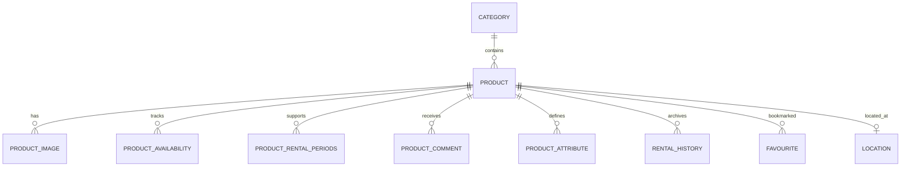

# Product Service

HemenKirala platformunda kiralanabilir ürünlerin, kategorilerin, stok bilgilerinin, uygunluk dönemlerinin, görsellerinin, yorumlarının ve favorilerinin yönetildiği REST servisidir.

---

## İçindekiler
- [Genel Bakış](#genel-bakış)
- [Mimari](#mimari)
- [Teknolojiler](#teknolojiler)
- [Veritabanı](#veritabanı)
- [API Endpoints](#api-endpoints)
- [Servisler Arası İletişim](#servisler-arası-i̇letişim)
- [Kurulum](#kurulum)
- [Ortam Değişkenleri](#ortam-değişkenleri)
- [Testler](#testler)
- [Loglama](#loglama)

---

## Genel Bakış

Product Service aşağıdaki ürün yaşam döngüsü işlemlerini sağlar:

- Ürün oluşturma, listeleme, filtreleme, arama, güncelleme ve silme
- Kategori ve ürün konumu oluşturma
- Ürün stok miktarını sorgulama ve sipariş olaylarıyla azaltma
- Ürünlerin kira dönemlerini ve uygunluk kayıtlarını yönetme
- Ürün görsellerini AWS S3 üzerinde saklama
- Ürün yorumlarını ve kullanıcı favorilerini yönetme
- PostgreSQL şemasını Flyway migration'larıyla güncel tutma

Ürün silme işlemi soft delete olarak uygulanır. Silinmiş ürünler normal ürün sorgularında döndürülmez.

---

## Mimari

### Katmanlar

- **Controller:** HTTP isteklerini alır, doğrulama ve HTTP durum kodlarını yönetir.
- **Service:** Ürün, kategori, uygunluk, görsel, yorum, favori ve konum iş kurallarını yürütür.
- **Repository:** Spring Data JPA ile PostgreSQL erişimini sağlar; ürün filtreleme için specification yapısı kullanılır.
- **Model:** JPA entity'leri ve enum'lar (`Product`, `Category`, `ProductAvailability`, `ProductImage`, `ProductComment`, `ProductAttribute`, `Favourite`, `Location`).
- **DTO / Mapper:** API sözleşmelerini entity'lerden ayırır; MapStruct dönüşümleri kullanılır.
- **Event:** Kafka üzerinden stok azaltma olaylarını tüketir ve başarısız işlemleri DLT'ye yönlendirir.
- **Storage:** AWS S3 yükleme, listeleme, URL oluşturma ve silme işlemlerini sağlar.
- **Cross-cutting:** İstek loglama, AOP loglama, global exception handling ve OpenTelemetry gözlemlenebilirliği bulunur.

### Klasör Yapısı

```text
src/main/java/com/lendmate/productservice/
├── controller/       # REST endpoint'leri
├── service/          # Servis arayüzleri ve implementasyonları
├── repository/       # JPA repository'leri ve ürün filtreleme sorguları
├── model/            # Entity, enum ve projection sınıfları
├── dto/              # requestDto ve responseDto sınıfları
├── mapper/           # MapStruct mapper'ları
├── kafka/            # Kafka consumer'ları
├── event/            # Event modelleri ve event consumer'ları
├── config/           # Kafka, S3, Redis ve CORS yapılandırması
├── expection/        # Exception sınıfları ve global handler
├── aspect/           # Loglama aspect'i
└── util/             # Ortak yardımcılar
```

---

## Teknolojiler

| Teknoloji | Versiyon | Kullanım Amacı |
|---|---|---|
| Java | 21 | Uygulama çalışma ortamı |
| Spring Boot | 3.5.13 | Uygulama çatısı |
| Spring Data JPA / Hibernate | Spring Boot ile | ORM ve PostgreSQL erişimi |
| PostgreSQL | Harici servis | Kalıcı veri saklama |
| Flyway | Spring Boot ile | Veritabanı migration yönetimi |
| Spring Kafka | Spring Boot ile | Asenkron stok olayları |
| Redis | Starter mevcut | Cache altyapısı; cache yapılandırması şu an pasif |
| AWS SDK S3 | 2.44.4 | Dosya ve görsel depolama |
| MapStruct | 1.6.3 | Entity-DTO dönüşümü |
| Springdoc OpenAPI | 2.8.5 | Swagger/OpenAPI dokümantasyonu |
| OpenTelemetry | 2.6.0 | Trace ve gözlemlenebilirlik |
| Micrometer OTLP | Spring Boot ile | Metriklerin OTLP collector'a aktarımı |
| Maven Wrapper | Projeyle birlikte | Build ve test çalıştırma |

---

## Veritabanı

### Tablolar

Flyway migration'ları `src/main/resources/db/migration` altında sıralı olarak çalışır. Ana tablolar:

| Tablo | Açıklama |
|---|---|
| `product` | Ürün bilgileri, sahip, kategori, fiyat, stok ve soft delete alanları |
| `category` | Ürün kategorileri ve kategori görseli |
| `location` | Ürün konum bilgileri |
| `product_image` | Ürün görsel kayıtları ve primary görsel bilgisi |
| `product_availability` | Ürünün kiralama, engelleme ve bakım dönemleri |
| `product_rental_periods` | Ürün için seçilebilir kira dönemleri |
| `product_comment` | Ürün yorumları |
| `product_attribute` | Ürün özellikleri |
| `favourite` | Kullanıcı-ürün favori ilişkisi |
| `rental_history` | Tamamlanan kiralamaların geçmişi |

`product_availability` üzerinde ürün ve tarih alanlarını kullanan indeksler bulunur. Kiralama süresi sona eren kayıtların geçmişe taşınması için `rental_history` tablosuna bağlı bir PostgreSQL trigger'ı tanımlıdır.

### Şema Diyagramı



---

## API Endpoints

### Ürünler
| Method | Endpoint | Açıklama | Auth |
|---|---|---|---|
| GET | `/products/health` | Servis sağlık kontrolü | Swagger Bearer gereksinimi |
| POST | `/products` | Ürün oluşturur | Swagger Bearer gereksinimi |
| GET | `/products/{id}` | ID ile ürün getirir | Swagger Bearer gereksinimi |
| GET | `/products` | Sayfalı ürün listesi; kategori, marka, fiyat ve kira günü filtreleri desteklenir | Swagger Bearer gereksinimi |
| PUT | `/products/{id}` | Ürün günceller | Swagger Bearer gereksinimi |
| DELETE | `/products/{id}` | Ürünü soft delete yapar | Swagger Bearer gereksinimi |
| GET | `/products/batch?ids=1,2` | Birden fazla ürün getirir | Swagger Bearer gereksinimi |
| GET | `/products/search?text=...` | Metin ve filtrelerle ürün arar | Swagger Bearer gereksinimi |
| GET | `/products/brands` | Filtrelere uyan benzersiz markaları getirir | Swagger Bearer gereksinimi |
| GET | `/products/user?ownerId={id}` | Sahibe ait ürünleri sayfalı getirir | Swagger Bearer gereksinimi |
| POST | `/products/internal/quantities` | Ürün ID'leri için stok miktarlarını döndürür | Swagger Bearer gereksinimi |

### Kategoriler, Uygunluk ve Konum
| Method | Endpoint | Açıklama | Auth |
|---|---|---|---|
| POST | `/categories` | Kategori oluşturur | Belirtilmemiş |
| GET | `/categories/{id}` | Kategori getirir | Belirtilmemiş |
| GET | `/categories` | Tüm kategorileri listeler | Belirtilmemiş |
| PUT | `/categories/{id}` | Kategori günceller | Belirtilmemiş |
| DELETE | `/categories/{id}` | Kategori siler | Belirtilmemiş |
| POST | `/product-availability` | Ürün uygunluk kaydı oluşturur | Belirtilmemiş |
| DELETE | `/product-availability?id={id}` | Uygunluk kaydını siler | Belirtilmemiş |
| GET | `/product-availability/internal/expired-rented` | Süresi dolan kiralama kayıtlarını işler | Belirtilmemiş |
| POST | `/location` | Konum oluşturur | Belirtilmemiş |

### Görseller, Yorumlar ve Favoriler
| Method | Endpoint | Açıklama | Auth |
|---|---|---|---|
| POST | `/product-image/{productId}/images` | Ürüne görsel adları ekler | Belirtilmemiş |
| DELETE | `/product-image` | Görselleri ID listesiyle siler | Belirtilmemiş |
| POST | `/product-comments` | Yorum oluşturur | Belirtilmemiş |
| GET | `/product-comments/product/{id}` | Ürün yorumlarını listeler | Belirtilmemiş |
| PUT | `/product-comments/{id}` | Yorumu günceller | Belirtilmemiş |
| DELETE | `/product-comments` | Yorumları ID listesiyle siler | Belirtilmemiş |
| POST | `/favourites` | Favori oluşturur | Belirtilmemiş |
| GET | `/favourites/{id}` | Favori getirir | Belirtilmemiş |
| GET | `/favourites` | Tüm favorileri listeler | Belirtilmemiş |
| GET | `/favourites/user/{userId}` | Kullanıcının favorilerini listeler | Belirtilmemiş |
| PUT | `/favourites/{id}` | Favori günceller | Belirtilmemiş |
| DELETE | `/favourites/{id}` | Favori siler | Belirtilmemiş |

### Dosyalar (AWS S3)
| Method | Endpoint | Açıklama | Auth |
|---|---|---|---|
| POST | `/files/upload` | `multipart/form-data` ile dosya yükler | Belirtilmemiş |
| GET | `/files` | S3 dosyalarını listeler | Belirtilmemiş |
| GET | `/files/download?fileName=...` | Dosya URL'si oluşturur | Belirtilmemiş |
| DELETE | `/files?fileName=...` | S3 dosyasını siler | Belirtilmemiş |

---

## Servisler Arası İletişim

### Feign Client (Senkron)

Bu projede Feign Client tanımı bulunmuyor. Senkron iletişim, diğer servislerin bu servisin REST endpoint'lerini çağırmasıyla yapılabilir.

### Kafka Events (Asenkron)

- `quantity-decrease-topic` topic'i, `product-service` consumer group'u ile dinlenir.
- `StockDecreaseEvent` alındığında ilgili ürünlerin stokları azaltılır.
- İşlem başarısız olursa retry topic mekanizması üzerinden DLT'ye gider.
- `user.deleted` consumer kodu mevcut olsa da şu anda yorum satırındadır ve aktif değildir.

---

## Kurulum

### Gereksinimler

- JDK 21
- Maven Wrapper (`./mvnw`)
- Docker ve Docker Compose (container ile çalıştırma için)
- PostgreSQL
- Prod/stage profillerinde erişilebilir Spring Cloud Config Server
- Kafka, stok olaylarının tüketilmesi için gereklidir.
- S3 endpoint'leri için AWS kimlik bilgileri gereklidir.

### Çalıştırma

```bash
./mvnw test
./mvnw spring-boot:run -Dspring-boot.run.profiles=dev
docker compose -f docker-compose-local.yml up --build
```

Uygulama varsayılan olarak `http://localhost:8080` adresinde açılır. OpenAPI arayüzü `/swagger-ui/index.html` altında sunulur.

Local compose dosyası, önceden oluşturulmuş harici `lendmate-net` ağı ve `postgres` hostname'i bekler. Prod compose dosyası aynı ağı kullanır; veritabanı parolası ve AWS bilgileri ortam değişkenlerinden sağlanır.

---

## Ortam Değişkenleri

| Değişken | Açıklama | Örnek |
|---|---|---|
| `SPRING_PROFILES_ACTIVE` | Aktif Spring profili | `dev` |
| `CONFIG_SERVER_URL` | Spring Cloud Config Server adresi | `http://localhost:8888` |
| `SPRING_DATASOURCE_URL` | PostgreSQL JDBC bağlantısı | `jdbc:postgresql://postgres:5432/product_service_db_dev` |
| `SPRING_DATASOURCE_USERNAME` | PostgreSQL kullanıcı adı | `lendmate` |
| `SPRING_DATASOURCE_PASSWORD` | PostgreSQL parolası | `lendmate` (local) |
| `AWS_ACCESS_KEY_ID` | S3 erişim anahtarı | `${AWS_ACCESS_KEY_ID}` |
| `AWS_SECRET_ACCESS_KEY` | S3 gizli erişim anahtarı | `${AWS_SECRET_ACCESS_KEY}` |
| `AWS_REGION` | S3 bölgesi | `eu-central-1` |
| `OTEL_EXPORTER_OTLP_ENDPOINT` | OpenTelemetry collector adresi | `http://otel-collector:4318` |
| `OTEL_SERVICE_NAME` | Telemetri servis adı | `product-service` |

Kafka broker, Redis, S3 bucket ve diğer uygulama ayarları profillere göre Config Server'dan sağlanır. Hassas değerler repoya eklenmemelidir.

---

## Testler

Testler JUnit 5 ve Spring Boot Test ile yazılmıştır:

- `LendmateApplicationTests`: Spring uygulama context'inin yüklenmesini doğrular.
- `ProductControllerIntegrationTest`: MockMvc ile ürün oluşturma, okuma, güncelleme, soft delete, validasyon ve 404/409 senaryolarını test eder.
- `ProductServiceImplTest`: Ürün servisinin Mockito tabanlı birim testlerini içerir; stok sorgusu, ürün yaşam döngüsü ve exception senaryolarını kapsar.

```bash
./mvnw test
```

---

## Loglama

Her bir servisten opentelemetry + micrometer kullanarak toplanılan log, trace ve metrikler ilgili gui araçları ile görselleştirilmiştir.

Metrikleri ve logları takip ettiğimiz teknoloji: Grafana


Servisler arası trace id'ler ile takip ettiğimiz giden isteklerin akışını ve zamanını görüntülediğimiz teknoloji: Jaeger


